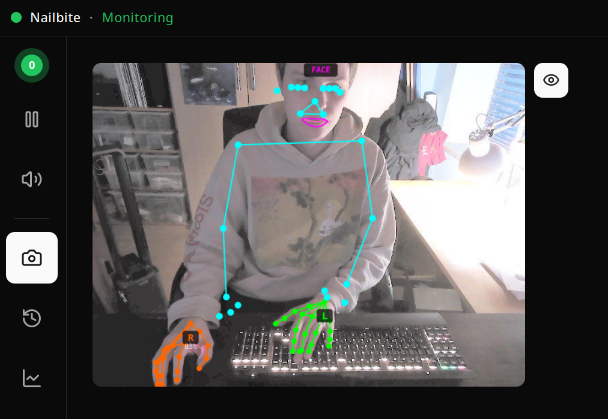

# n**AI**lbite

**A quiet companion that notices when your hands wander to your face — and gently lets you know.**

If you've ever caught yourself mid-bite and thought "oh, again" — n**AI**lbite is built for that
moment. It watches your webcam, recognises a small set of body-focused repetitive behaviours
(BFRBs) — currently nail biting and nail picking — and surfaces a soft alert when it sees one.
That's it. No streaks, no scolding, no leaderboards. You decide what to do with the nudge.

Everything happens on your own machine. Nothing is uploaded.

## Why this exists

I needed something that would stop me from biting my nails while I'm sitting at
my desk. By the time I notice my hand is at my mouth, it's already too late —
the whole thing happens below the level of conscious attention. Nothing I tried
(bitter polish, hair ties, sticky notes on the monitor) survived a deep work
session.

What did work was having someone sitting next to me who would say "hey, you're
doing it again." That's the role this tool is built to fill: a patient external
observer that never gets tired, never judges, never makes a thing of it — just
quietly says "hey" so I can put my hand back down and carry on.

It's a personal tool, shared in case it's useful to someone else with the same
problem. It is not a medical device, and it doesn't try to be one.

## What it does

- **Notices the gesture.** Hand/face/pose tracking with on-device ONNX models, running at a
  modest ~8 FPS so it's friendly to your CPU.
- **Waits for sustained contact** before alerting (a brief brush of the lip won't trigger it).
- **Plays a soft sound and a desktop notification** so you can choose to redirect the gesture.
- **Lets you label each alert** "correct" or "false positive" with one click, so the thresholds
  can be tuned to *your* hands over time.
- **Keeps a short clip and the landmark trace** of each event in `~/.local/share/nailbite/` so
  you can review what happened if you want to — and delete it if you don't.
- **Runs entirely locally.** No telemetry, no cloud, no account. The only network feature is
  an optional webhook that ships off by default.

## What it doesn't do (yet)

- Hair pulling, skin picking, lip biting — these have detector stubs but aren't enabled. The
  generic pipeline is there; per-behaviour signals need tuning before they're trustworthy.
- macOS / Windows. Linux x86_64 only at the moment; the camera and tray code are behind
  platform traits so the door is open.
- "Coaching" or gamification. By design — a counter that nudges you toward a number can turn
  into another source of shame, which is the opposite of what helps.

## Screenshot

<p align="center">
  
</p>

The live preview during monitoring. Hand landmarks (green = left, orange = right)
ride on top of the face mesh and pose torso so you can see exactly what the
detector is seeing — useful when you're tuning thresholds, and reassuring when
you want to know what is and isn't being tracked.

## Install

Pre-built binaries are on the [Releases page](../../releases/latest) for every tagged
version. The release notes include copy-paste install commands with exact URLs.

Pick whichever format you prefer; both contain the same app.

### AppImage (works on most distros, no install needed)

Download the AppImage for your hardware, then:

```bash
chmod +x nailbite_*_amd64-cpu.AppImage
./nailbite_*_amd64-cpu.AppImage
```

On **NixOS**:

```bash
nix-shell -p appimage-run --run './nailbite_*_amd64-cpu.AppImage'
```

On **Ubuntu 24.04** the AppImage needs the legacy FUSE shim:

```bash
sudo apt install libfuse2t64
```

### Debian / Ubuntu (.deb)

```bash
sudo apt install ./nailbite_*_amd64-cpu.deb
```

### GPU builds

CPU is fine for most people — the detection pipeline is light. If you have a discrete GPU and
want the headroom, replace `cpu` in the filename with the backend matching your hardware:

| Backend | Filename suffix | Runtime requirement              |
|---------|-----------------|----------------------------------|
| CPU     | `-cpu`          | none                             |
| NVIDIA CUDA     | `-cuda`     | NVIDIA driver 525+, CUDA 12.x    |
| NVIDIA TensorRT | `-tensorrt` | NVIDIA driver 525+, CUDA 12.x    |
| AMD ROCm        | `-rocm`     | AMD ROCm 6.0+                    |
| AMD MIGraphX    | `-migraphx` | AMD ROCm 6.0+                    |

### Verifying downloads

Every release ships a `SHA256SUMS.txt`. Drop it next to the binary you downloaded and run:

```bash
sha256sum -c SHA256SUMS.txt --ignore-missing
```

### Requirements

- Linux x86_64 (NixOS, Arch, Debian 12+, Ubuntu 22.04+ tested)
- A V4L2-compatible webcam (most USB and laptop cameras work out of the box)
- Membership of the `video` group (most distros add the primary user automatically)

## Using it

The first launch downloads a small set of ONNX models (~50 MB) and caches them locally. After
that, n**AI**lbite lives in your system tray:

- 🟢 monitoring
- 🟡 paused
- 🔴 BFRB currently detected
- ⚫ no one in frame
- ⚪ offline

A few keys you'll probably want:

| Key | Action |
|-----|--------|
| F9  | Dismiss the latest alert as a false positive (helps the detector learn) |
| F10 | Mark a missed event (false negative) |
| F11 | Pause / resume detection |

When an alert fires you get an inline "Correct / False positive" choice on the notification
itself. The history page lets you scrub through past events with the landmarks overlaid, and
the insights page sweeps thresholds against your labels to suggest tuning.

## Configuration

The single source of truth is `config.yaml`. The defaults are tuned to be conservative
(prefers missing a real event to firing a false one), and the camera bias is set up so your
face stays well-lit even with a bright window behind you.

A small taste:

```yaml
camera:
  inference_fps: 8
  controls:
    gamma_reset: true               # reset gamma to driver default at startup
    auto_exposure: true
    exposure_auto_priority: true    # let exposure stretch in dim / backlit scenes
    auto_white_balance: true
    auto_gain: true
    backlight_compensation_max: false   # opt-in for backlit scenes only
    brightness_fraction: null       # null = keep camera default
    contrast_fraction: null
  sources:
    - id: main
      device: /dev/video0
      role: primary

detection:
  behaviors:
    nail_biting:
      enabled: true
      proximity_threshold: 0.35
      min_sustained_ms: 1000        # 1s of dwell before alerting

ort:
  gpu:
    preference: auto                # auto / disabled / required
```

See `docs/configuration.md` for the full reference.

## How it works under the hood

1. **Camera** → frames pulled from V4L2.
2. **Detection + rotation** → palm and face SSD models emit bounding boxes *and* keypoints
   (palm: wrist + finger MCPs; face: eye line). The pipeline rotates each crop so the hand's
   fingers point up and the face's eyes are horizontal before the landmark model sees it —
   that's the distribution those models were trained on, and the single biggest factor in
   how stable the predictions look frame-to-frame.
3. **Landmarks** → hand (21 keypoints), face (468), pose (33) run on the rotated crops; the
   outputs are inverse-rotated back into image space for visualisation and the behaviour
   detectors.
4. **Behaviour analysis** → temporal smoothing + per-hand explanations decide whether the
   geometry actually looks like nail biting or picking, rather than typing, eating, scratching
   an itch, or resting on a chin.
5. **Alert + label** → soft sound, desktop notification with inline labels, snapshot saved to
   your local history.

More detail in `docs/architecture.md` and `docs/detection.md`.

## Privacy

This is software that points a camera at you. Privacy isn't a bullet point — it's the whole
shape of the thing.

- No video frames or images ever leave your machine.
- No cloud, no account, no telemetry.
- Event clips and stats live under `~/.local/share/nailbite/`. They are yours; delete them
  whenever you like.
- The only optional network feature is a webhook (disabled by default) so you can route alerts
  into your own systems if you want.

## Research direction & looking for collaborators

The current detector is **geometric**: it runs off-the-shelf hand, face, and
pose landmark models on each frame and then asks rule-based questions of the
landmark coordinates — "are any fingertips close to the outer-lip contour for
at least 4 seconds, while the other hand isn't keyboard-shaped?". That works,
and it's transparent (every alert ships an `explanation` field saying *which*
signals contributed and *which* suppressions fired), but it's a ceiling:

- Geometric proximity can't tell *biting* from *resting fingertip on lip*.
- Per-frame rules don't capture the small temporal signature of the bite
  itself (the brief inward jaw motion, the fingers pulling away).
- Tuning is a manual sweep across thresholds, when the dataset already exists
  to learn them.

What I'd love to do — and what I'd love help with — is replace the geometric
heuristic with a **small learned model**: probably a spatiotemporal CNN or a
short-clip video transformer, taking the existing 11-frame clip plus the
landmark traces as inputs and outputting a per-event probability for each
behaviour. The labelled data is already being collected on every install:

- Multi-frame clips (raw JPEGs + per-frame landmark traces) around every
  alert and every user-marked missed event.
- Per-event `verdict` labels (`true_positive` / `false_positive` / `unsure`)
  added by the user through the same notification or hotkey that produced
  the alert.

Format and field-by-field schema are documented in
[`docs/data-format.md`](docs/data-format.md).

### Where I'd particularly love a second brain

- **Dataset shape**: what makes this dataset usable for training vs. what's
  missing (hard negatives, inter-rater agreement, privacy-preserving export
  for cross-user pooling). Some of this is sketched at the bottom of
  `data-format.md`.
- **Model architecture**: clip-level vs. landmark-sequence vs. hybrid; how
  much temporal context actually matters; whether per-behaviour heads share
  a backbone.
- **Federated / on-device fine-tuning**: the headline privacy property
  (nothing leaves your machine) is the whole point of the project, so the
  ideal training path is one that doesn't violate it — federated, fully
  on-device, or aggressively-anonymised before any pooling.
- **Evaluation**: more honest metrics than "the detector fires on the
  recorded clips" — leave-one-user-out, calibration plots, time-to-detect.

If any of that is your kind of fun, please open a discussion or an issue.
This is genuinely a "would love to work with someone who knows what they're
doing" ask, not a "PRs welcome" boilerplate.

## Build from source

Required: Rust 1.88+, Node.js 22+, pnpm 10+.

System packages (Debian / Ubuntu):

```bash
sudo apt install \
    libwebkit2gtk-4.1-dev libgtk-3-dev libglib2.0-dev \
    libayatana-appindicator3-dev librsvg2-dev libsoup-3.0-dev \
    libjavascriptcoregtk-4.1-dev libasound2-dev libxdo-dev \
    libv4l-dev libssl-dev cmake clang
```

On NixOS, `nix-shell` handles all of this for you.

```bash
git clone https://github.com/firstdorsal/nailbite.git
cd nailbite
pnpm install
pnpm tauri dev
```

### Reproducible release builds (Docker)

The release pipeline uses these scripts; running them locally produces byte-identical
artifacts to the published ones.

```bash
bash build.sh                       # CPU-only AppImage + .deb in ./dist
GPU_BACKEND=cuda bash build.sh
GPU_BACKEND=tensorrt bash build.sh
GPU_BACKEND=rocm bash build.sh
GPU_BACKEND=migraphx bash build.sh

bash scripts/run-appimage.sh        # build + launch in one step
```

## Development

```bash
pnpm test                       # Frontend tests (vitest)
cd src-tauri && cargo test      # Backend tests
pnpm lint && pnpm typecheck     # Frontend checks
cd src-tauri && cargo clippy    # Backend lint
```

## Contributing

This is a personal project, but issues and small PRs are welcome — especially:

- Reports of false positives / negatives with the event clip attached (it's already saved
  locally, no extra work).
- New behaviour detectors implementing the `BehaviorDetector` trait.
- macOS or Windows camera backends behind the existing platform traits.

If you're trying it out and something feels wrong (it scolds you too much, the sound is too
loud, the alert dwell is too short), that's exactly the feedback that helps the defaults get
kinder over time.

## License

GNU Affero General Public License v3.0 — see `LICENSE`.

In short: you're free to use, modify, and redistribute n**AI**lbite. If you run a
modified version as a network service, you have to make your source available
to its users too. The aim is to keep the tool — and any improvements made to
it — open for the community that depends on it.

## Acknowledgments

- Hand landmark + palm detection models from [OpenCV Zoo](https://github.com/opencv/opencv_zoo).
- Face detection + mesh from [IntelliProve](https://github.com/IntelliProve/face-detection-onnx).
- Pose landmark from [BlazePose via Unity Inference Engine](https://huggingface.co/unity/inference-engine-blaze-pose).
- Built on the shoulders of [Tauri](https://tauri.app/), [React](https://react.dev/), and
  [ONNX Runtime](https://onnxruntime.ai/).

And a quiet thank-you to anyone whose research on habit reversal and decoupling made this
worth building in the first place.
